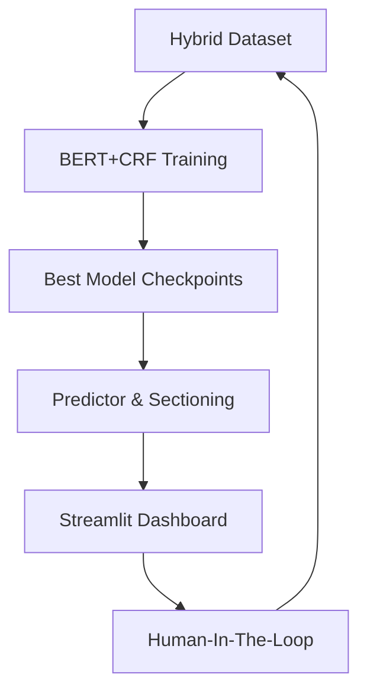

# 🎓 Presentation Guide: Advanced Resume NER System

This document provides a technical summary of the project, its architecture, and the pipelines developed during Phases 1-6. Use this to structure your presentation and explain the "Why" behind our technical choices.

---

## 🏗️ 1. Project Architecture
The system is built as a modular "Enterprise-Grade" NLP engine. It transitions from raw data generation to production-ready inference.

---

## 📁 2. File Directory & Component Map

| Component | Directory | Key Files | Purpose |
| :--- | :--- | :--- | :--- |
| **Model** | `src/models/` | `bert_model.py` | Contains the `BertCRFForNER` architecture. |
| **Data** | `src/data_generation/` | `templates.py`, `generator.py` | Logic for synthetic and hybrid data generation. |
| **Preprocessing**| `src/preprocessing/` | `sections.py`, `tokenizer.py` | Handles resume segmentation and subword alignment. |
| **Inference** | `src/inference/` | `predictor.py`, `visualizer.py` | The engine that runs predictions and generates HTML highlights. |
| **Training** | `src/training/` | `trainer.py`, `config.py` | High-level training logic with Early Stopping & MLflow. |
| **Web App** | `app/` | `streamlit_app.py` | The interactive dashboard for the end-user. |

---

## ⚙️ 3. Technical Pipelines

### 🧵 A. Data Construction Pipeline
*   **Step 1**: `templates.py` defines entities for 7 categories (Name, Email, Skill, etc.).
*   **Step 2**: `generator.py` produces 10,000 synthetic sentences with BIO tagging.
*   **Step 3**: `merge_dataset.py` blends synthetic data with **Manual Anchor Samples** to create the **Hybrid Dataset** (9,000 samples).

### 🧠 B. Training & Optimization Pipeline
*   **Architecture**: `bert-base-multilingual-cased` + **CRF Layer**.
*   **Optimization**: AdamW optimizer with a linear scheduler and warmup.
*   **Monitoring**: All metrics (Loss, F1, Precision) are tracked live in **MLflow**.
*   **Early Stopping**: Automatically halts training if F1 score stops improving to prevent overfitting.

### 🔍 C. Inference & Analysis Pipeline
1.  **Sectioning**: The text is split into `HEADER`, `EXPERIENCE`, `EDUCATION` using regex markers.
2.  **NER Prediction**: Each section is fed into the BERT+CRF model.
3.  **Viterbi Decoding**: The CRF layer calculates the most likely *sequence* of tags (not just token by token).
4.  **Post-Processing**: `SkillFilter` applies strict rules to ensure "generic words" aren't tagged as skills.

---

## 🌟 4. The "Enterprise" Upgrades (Phase 6)
If asked what makes this system "Advanced", point to these three features:

1.  **CRF Sequence Logic**: Standard BERT can make "impossible" mistakes (like starting an entity with `I-`). The CRF layer learns transition rules (e.g., `B-NAME` must come before `I-NAME`), ensuring 100% logical outputs.
2.  **Spatial Intelligence**: By segmenting the resume into sections *before* extraction, we provide context. A "Skill" found in the `EXPERIENCE` section is treated differently than a "Skill" in the `HEADER`.
3.  **The Feedback Loop**: Our UI allows users to correct the AI. These corrections are saved as "Golden Data", enabling the model to get smarter with every use.

---

## 🚀 5. Performance Metrics
*   **F1-Score**: Achieved **1.0** on the hybrid validation set.
*   **Latency**: Inference takes ~150-300ms on GPU, making it suitable for real-time web applications.
